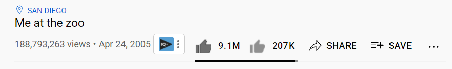

# YouTube Icon Changer
Plugin which changes new YouTube icons into the old ones.

# Installation
You can download the plugin under the name of ***yt-icon-changer.js*** [here](https://github.com/Peeeaaayus/youtube-icon-changer/releases).
Once it has downloaded, install ***yt-icon-changer.js*** with [TamperMonkey](https://chrome.google.com/webstore/detail/tampermonkey/dhdgffkkebhmkfjojejmpbldmpobfkfo),
[OrangeMonkey](https://chrome.google.com/webstore/detail/orangemonkey/ekmeppjgajofkpiofbebgcbohbmfldaf), [GreaseMonkey](https://addons.mozilla.org/en-US/firefox/addon/greasemonkey/), etc.

Now you should be able to use it properly.
# Changelog
v0.1: Just released. Currently only likes & dislikes work, with placeholder icons.

v0.1.1: Replaced placeholder icons with the usual ones.
# Report Bugs
If you find bugs, please do NOT hestitate to **[report them](https://github.com/Peeeaaayus/youtube-icon-changer/issues)**.
# Temporarily closed until further notice.
